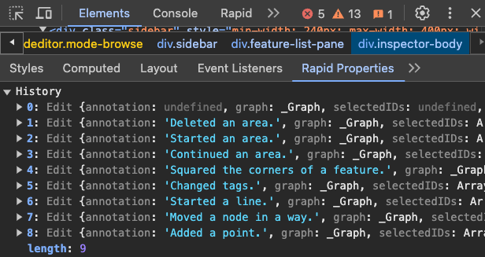
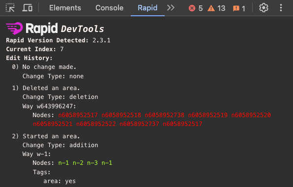

Rapid DevTools
===
Rapid DevTools is a Chrome DevTools extension designed to enhance the development and debugging experience for [Meta's Rapid](https://github.com/facebook/Rapid), an AI-enhanced editor for OpenStreetMap.
This extension provides a suite of tools and features tailored to streamline workflows, making it easier for developers to collaborate and improve Rapid.

It currently features the following:
* A sidebar showing the list of objects in Rapid's editor history. This would otherwise need to be logged in the console using `rapidContext.systems.editor.history`\
  
* A panel showing real-time updates to the Rapid history context and difference between each update.\
  

Extension Installation
===
 * Open [chrome://extensions](chrome://extensions)
 * Enable 'Developer Mode' checkbox
 * Click 'Load unpacked extensions...'
 * Select the `dist` folder

Usage
===
While in a local deployment of Rapid, launch the devtools, you should see a new tab called 'Rapid'. It currently displays the current version of Rapid running.

Development
===
When making changes to a clone of this repository, run `npm run quickstart` to compile changes in the dist folder.

Issues
===
If you encounter any issues, please report them on our [issue tracker](https://github.com/cubeydice/rapid-devtools/issues).
